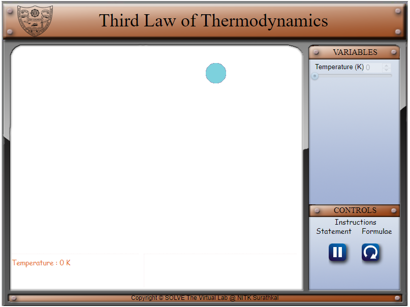
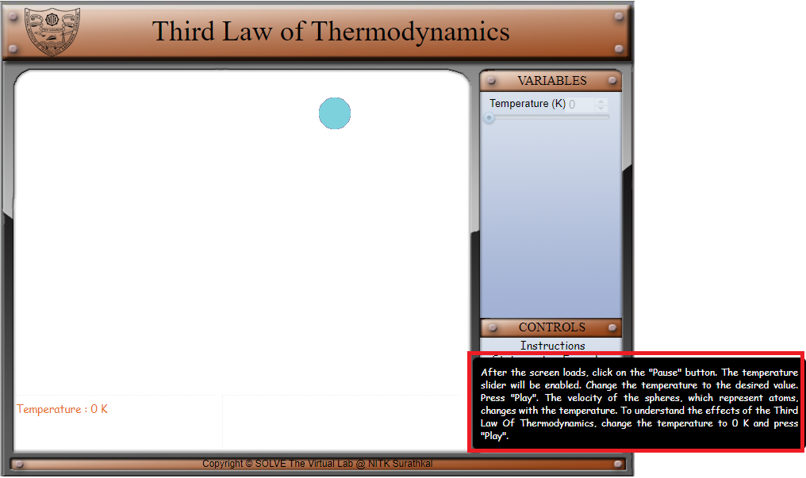
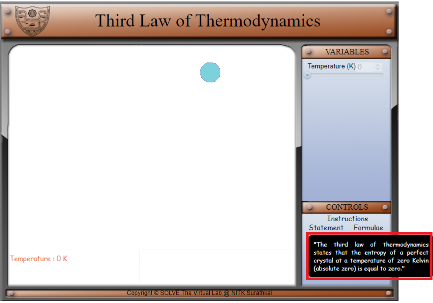
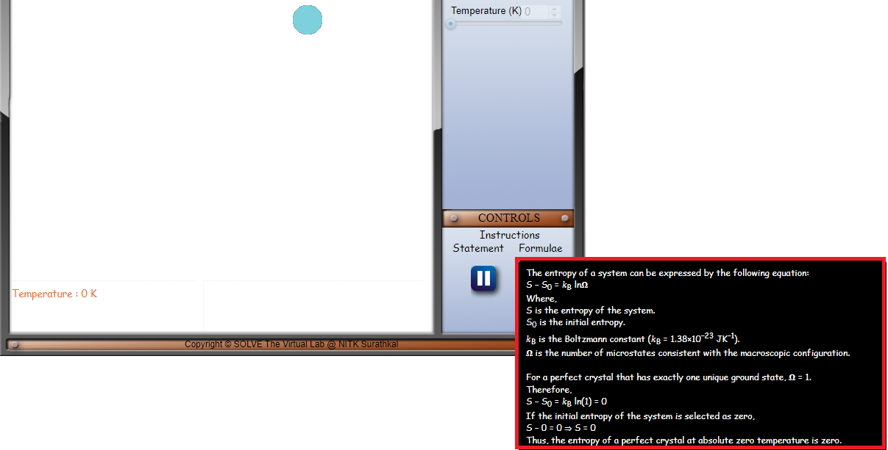
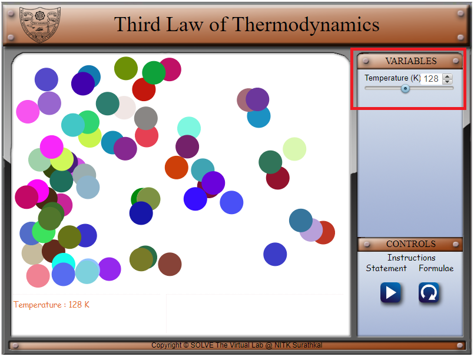
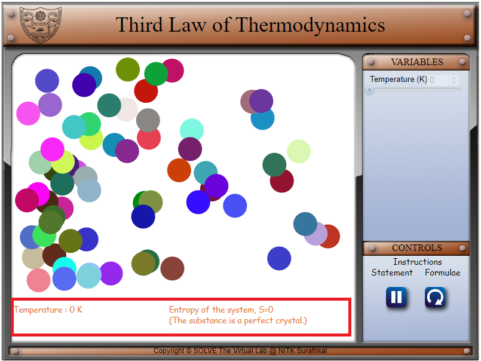
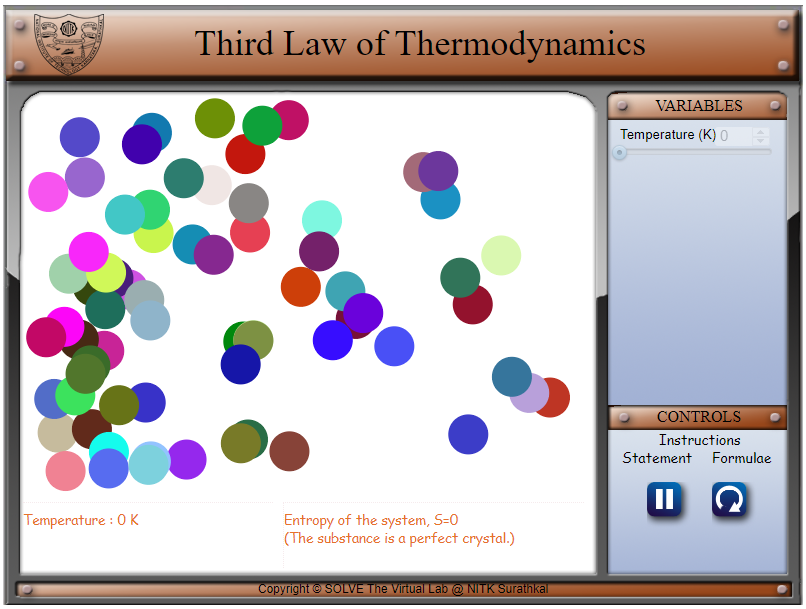

#### These procedure steps will be followed on the simulator

1. In the simulation window, several balls are available.

 

2. The instructions for the experiment, the statement of the third law of thermodynamics and the corresponding formula with the terms explained is displayed in the control panel when the cursor hovers over ‘Instructions’, ‘Statement’ and ‘Formulae’ respectively.

 

 

 

3. The parameters of the system can be varied by changing the variable (temperature) as shown below.

 

4. Use the slider to change the temperature of the system. It can be varied from 0 to 273 K.

 

5. The temperature of the system is displayed at the bottom. If the temperature is 0 K. a message saying that the entropy is 0, indicating that it is a perfect crystal is also displayed.

 

6. Visualize the effect of the change in speed with the temperature change.

 
