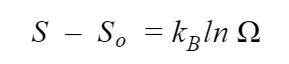

## INTRODUCTION 

The third law of thermodynamics states that the entropy of a perfect crystal at a temperature of zero Kelvin (which is known as the absolute zero) is zero.

#### User Objectives and Goals: 

1. Understand the third law of thermodynamics and its implications for a perfect crystal.
2. Interpret the change in the speed of the atoms as the temperature changes.
3. Calculate the entropy of the system at 0K.

#### Theory 

The third law of thermodynamics states that the entropy of a perfect crystal at a temperature of zero Kelvin (which is known as the absolute zero) is zero.

Entropy is a measure of the molecular disorder or the randomness of the system. At the absolute zero temperature, the system does not contain any heat and the atoms and molecules are at their lowest energy points i,e. ground states. Therefore, the entropy of such a system is zero.

This experiment depicts the third law with the help of balls (that can be thought of as atoms) whose speed, which is a representation of its energy, changes with the temperature until it goes to absolute zero.

#### Abbreviations: 

1. S = entropy of the system

2. So= initial entropy of the system

3. kB= Boltzmann constant (1.38 x 10⁻²³ J/K)

#### Equations/formulae: 

 
