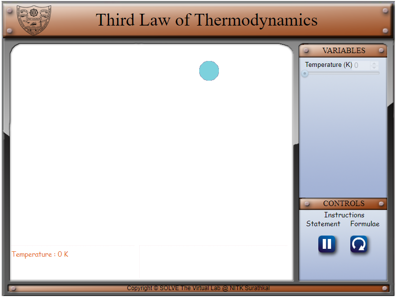

## Storyboard (Round 2)

Experiment: Third Law of Thermodynamics

**1. Story Outline**:

The third law of thermodynamics states that the entropy of a perfect crystal at a temperature of zero Kelvin (which is known as the absolute zero) is zero.

Entropy is a measure of the molecular disorder or the randomness of the system. At the absolute zero temperature, the system does not contain any heat and the atoms and molecules are at their lowest energy points i,e. ground states. Therefore, the entropy of such a system is zero.

This experiment depicts the third law with the help of balls (that can be thought of as atoms) whose speed, which is a representation of its energy, changes with the temperature until it goes to absolute zero.

 **2. Story**:

  **2.1 Set the visual stage description**:

  The experiment consists of around 70 balls. All the buttons and parameters control the right corner of the frame. The variable panel contains sliders for the temperature.

  The setup consists of around 70 balls that behave like atoms in this experiment.

  By changing the temperature of the system using the slider or the spinner, the speed of the atoms (and hence their energy and entropy) changes. When the temperature is 0K, it is displayed that the entropy of the system is zero and that it is a perfect crystal.

  **2.2 Set User Objectives & Goals**:

  1. Understand the third law of thermodynamics and its implications for a perfect crystal.
  2. Interpret the change in the speed of the atoms as the temperature changes.
  3. Calculate the entropy of the system at 0K.

  **2.3 Set the pathway activities**:

  1. The initial temperature is taken as 0K. 
  2. The temperature can be varied from 0 to 273K. \

  Change the parameters of the system to understand the change in the entropy of the atoms.

  **2.4 Set Challenges and Questions/Complexity/variation**

  **2.4.a Questions before simulation**:

  1. The entropy of a perfect crystal at 0K is zero.

  <ol type="a">
  <li>True</li>
  <li>False</li>

  Answer: a

    2. The entropy of a system at absolute zero is determined by the number of:

    <ol type="a">
    <li>Crystal lattices</li>
    <li>Ground states</li>
    <li>Number of protons in the atom</li>
    </ol>

    Answer: b

    3. The third law of thermodynamics is also known as:

     <ol type="a">
    <li>Nernst Law</li>
    <li>Boltzmann Law </li>
    <li>Maxwell Law</li>
    </ol>

    Answer: a

**2.4.b Questions after simulation**

4. What is the significance of the third law?

  <ol type="a">
 <li>It defines temperature</li>
 <li>It is useful in measuring chemical affinity</li>
 <li>It describes the behaviour of solids at low temperatures</li>
 <li>Both b and c</li>
 </ol>

 Answer: d

5. In the equation S - So =kBln(omega) , the symbol (omega) represents:

<ol type="a">
<li>The angular velocity of the atom</li>
<li>The number of microstates consistent with the macroscopic configuration</li>
<li>Gibbs number</li>
</ol>

Answer: b

6. For a perfect crystal omega is:

<ol type="a">
<li>0</li>
<li>1</li>
<li>10</li>

Answer: b

7. It is impossible to lower the temperature of any system to absolute zero in a finite number of steps.

<ol type="a">
<li>True</li>
<li>False</li>

Answer: a

**2.5 Allow pitfalls: NA**

**2.6 Conclusion**:

The time required to perform the virtual experiment:

The approximate time required to understand the third law, formulae and the procedure of the experiment would be 5 mins. The time required to understand the change the temperature to notice the change in the speed (hence energy and entropy) of the system is 5 mins. Thus, the total time required to perform the experiment is about 10 mins.

**2.7a Abbreviations:**

1. S = entropy of the system

2. So= initial entropy of the system

3. kB= Boltzmann constant (1.38 x 10⁻²³ J/K)

**2.7b Equations/formulae:**

 

 

<!-- # Below are the examples added for reference.
# To get mathematical equatios in html format: go to link: https://www.codecogs.com/latex/eqneditor.php and download equations in png format
# In the same link you have option to download equation as punching

### using png -->
<!--
//markdown syntax -->

<!-- //html syntax

 -->

**3. Flowchart**:

**4. Mindmap**:

**5. storyboard**:

1. In the simulation window, the Otto cycle graph and the piston are displayed.

 

2. The various symbols and the formulae involved in the experiment are displayed in the control panel when the cursor hovers over ‘Symbols’ and ‘Formulae’ respectively.

 

 

3. The parameters of the system can be changed by changing the variables as shown below. 

 

4. Move the sliders’ knobs to vary the pressures P1 and P3, the volumes v1 and v3 and gamma. P1 can be varied from 4 to 6 kPa. P3 can be varied from 50 to 60 kPa. V1 can be varied from 15 to 18 m3/kg. V3 can be varied from 5 to 6 m3/kg and gamma can be varied from 1.5 to 1.68. 

 

5. P1, P2, P3, P4, v1, v2, v3, v4, the compression ratio rk and the efficiency are displayed at the bottom. 

 

6. Visualize the change in the graph and the piston movement as the various parameters are changed.

 

**6. References**:

Basic and Applied Thermodynamics - P.K. Nag
Thermodynamics: An Engineering Approach - Yunus A Cengel, Michael A Boles
